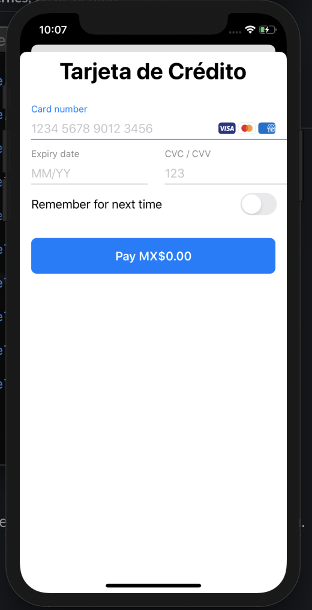
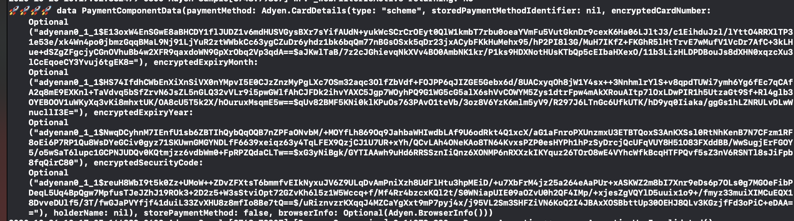

# Adyen Card Component For iOS  💳

This is a sample, that show how ti use Adyen card component in ios, how to manage the loader, and return the data that adyen gives you back, to send to your backend.

&emsp;
